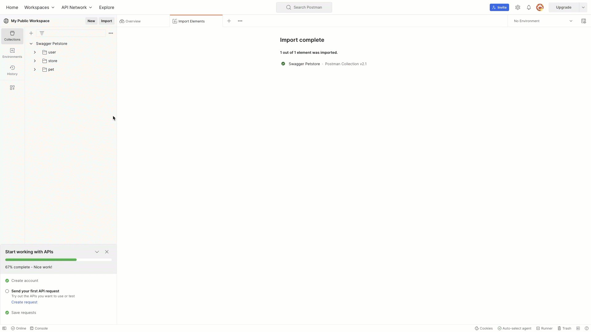

## Introduction

A nice feature of Postman is the ability to share your collections in public workspaces. If you have public APIs, this is a great way to showcase your endpoints.

In this guide, we'll look at how to build public API collections in Postman and integrate the collections with your API documentation.

### What we will cover

In this guide we'll look at how to:

1. Setup a public workspace in Postman.
2. Build an API collection from an existing OpenAPI Specification (OAS) file.
3. Share this API collection in your public workspace.
4. Add links to your documentation so users can import or fork your public collections.

## Setting up a public workspace in Postman

First we'll need to setup a Public workspace in Postman

### Sign in to Postman

1. If you haven’t already, [sign up for a free Postman account](https://www.postman.com/postman-account/).
2. Sign in to your account.

### Create a new workspace

In this example, we'll create a public workspace.

Pro tip

You can either create a Team workspace and change the visibility to Public, or you may create a Public Workspace, preset to Public visibility.

To create a new Public workspace:

1. Select the **Workspaces**.
2. Select **Create New**.
3. Give your workspace a name and an optional description.
4. Select **Public**.
5. Select **Create Workspace**.

## Importing an OAS into collections in Postman

Now that we have a public workspace, we need to import a collection or an OAS file to create a collection in the public workspace.

From here, we see how to upload an OAS file into your public workspace to build the public collections.

### Import OAS files into Postman

1. In your public Postman workspace, select **Import**, located in the top-left corner of the screen.
2. In the Import dialog, click Choose Files,  select your OAS file, and click Open.
3. To make sure Postman adds collections based on the OAS file, select **Show Import Settings** and make sure **Copy collections to workspace** is selected.
4. Select **Import** to upload the files into Postman. You will see your collection in the Collections window.

## Integrating Postman collections with your documentation

### Create hyperlink to share collection

1. Select the collection you want to share and then select Share Collection.
2. In the box, select **Via Run in Postman**. You can select either an HTML or Markdown snippet to embed in your website.

### Edit the API documentation

1. Locate the section in your API documentation where you want to link to your Postman collection.
2. Paste the HTML or Markdown snippet into your documentation.

After selecting **postman** the button, users can view, import, or fork the collection.

This is an example of the Postman button:

Imports vs. forks

Users can either _import_ or _fork_ public collections into their own workspaces. With either an import or a fork, you are making a copy of a collection and adding it to one of your workspaces.
Regardless of if you import a collection or fork it, there is no way to sync or automate updates between the new copy in your workspace and the original collection. If the original collection is updated, you can only update your collection manually with another import or fork.

For more information on adding Postman buttons to your website, see [Creating a Run in Postman buttons](https://learning.postman.com/docs/publishing-your-api/run-in-postman/creating-run-button/#creating-a-run-in-postman-button).

## Conclusion

**Great work!**

You have successfully set up a public workspace in Postman, built a collection using an OAS file, and made the collection publicly available.

And, you have integrated the Postman collection link into your API documentation, so users can view, import or fork your collection and test your APIs.

Keep Collections Updated

Remember to update the Postman collections whenever there are changes in your APIs and to keep your API documentation. This will ensure that your users always have access to the most current version of your API.

